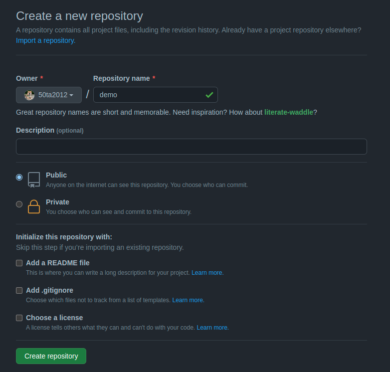

# Git 基礎操作

## 建立 GitHub Repository

Create a new repository > 輸入 Repository name > Create repository：



## 開始版本控制

```bash
# 開始版本控制
git init

# 加入所有檔案到暫存區
git add .

# commit 所有暫存區的檔案，並且附上說明
git commit -m "Git 基礎操作"

# 變更 master 的分支名稱為 main (純粹是 github 社群的喜好)
git branch -M main

# 加入遠端 github repository 網址，並且命名為 origin
git remote add origin <遠端 github url>

# push 專案到 github，並且預設 git push 快捷指令(未來打 git push 就會 push 專案到這個 github repository)
git push -u origin main
```

## 下載專案

下載專案：
```bash
git clone <遠端 github url>
```

## 從遠端更新本地專案

當遠端 (github repository) 專案版本超前本地的專案：
```bash
git pull <遠端 github url>
```

## 清除改動

清除所有改動，回復到最新的 commit 狀態：
```bash
git reset --hard
```

這個只會清除改動，如果連新增的檔案也想清除的話：
```bash
git checkout -- <檔案>
```